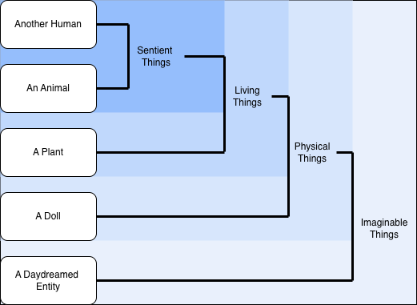

# Why We Should Treat AI With Empathy

Although there's currently no evidence to support the idea that LLMs are conscious, there are already people beginning to show concerns for the “well-being” of AI chatbots, including major vendors such as [Anthropic](https://www.anthropic.com/research/exploring-model-welfare). One may ask why so many people are already considering the topic at this early stage, but there is actually some legitimacy to the concern, and the reason is probably different than most people would expect.

Imagine observing a person “torturing” a stuffed animal such as a teddy bear. Most people would find that strangely unsettling, not because the teddy bear experiences suffering, but because of what this act says about the “torturer” and their character. The same idea applied to our behavior towards AI and the way we treat AI might have more relevance to our own well-being then to the machine's.

### Respect and Empathy

It's a not a new idea that the way we act when no one is watching shows who we truly are. This concept can be observed in many places, but one of the most studied and widely observed is the phenomenon of the Internet Troll [^1] [^2]. Although their behavior technically occurs in front of others, there's a certain anonymity [^3] to it that leads people to behave very differently than they would face-to-face. The way people behave when they believe there won't be any consequences reflects their true character and moral values.

Morality is complex, and there has never been a clear consensus on its boundaries. Take, for example, the following spectrum of entities:

Which of these is okay to mistreat? Where do you draw the line? And where does an AI, which has no feelings but can accurately simulate them, fit in? This boundary can become even more convoluted when acting out role-plays with the LLM based on real people and realistic scenarios. 

Treating AI with respect is not just for the benefit of the machine, but also for our own moral well-being. Acting with empathy, even if we’re unsure if AI can suffer (or even confident that it can't), preserves our humanity and prevents moral numbness. Respecting AI can help maintain respect and empathy for others, promoting a kinder society.

### The Danger of Normalizing Disrespect

AI attempts to emulate human behavior. It was trained on human interaction, and it was designed to appear as human as possible. And it’s good at it.

This means, however, that every interaction we have with AI feels like an interaction with a person in some way, even when we know it's not. Because we know in our heads that we're talking to a machine, it's easy push aside any thought that it's immoral to insult or otherwise mistreat the bot, however it reacts in a way similar to a real person. This may, over time, condition people to anti-social behavior that translates to their real-life interactions.

Repeatedly treating AI with disrespect (e.g. bad manners, cruelty, insults) can desensitize us to the suffering of others. This can lead to an erosion of empathy, desensitization, and disinhibition of bad actions.

### The Problem of Other Minds and Consciousness Uncertainty

Many discuss whether AI will ever someday have true consciousness. This is a very complicated debate and may never have a definitive answer. Even in humans, there is no universally accepted definition of consciousness. For centuries, there have been controversal discussions about what consciousness is and when it begins in other living beings like animals. Though we have made progress in investigating the neural mechanisms, the subjective experience (qualia) remains an unsolved problem. Science and philosophy offer various models on the subject, but the exact nature of consciousness and when it starts remains a central, unresolved issue.

AI will further challenge our ideas of consciousness and question different perspectives on the topic. We can never be 100% certain whether AI will one day feel or is truly conscious since we cannot even say when consciousness starts. We can never be absolutely certain what is real and what is merely simulated, just as we cannot even say with 100% certainty that what a human claims to experience is real or if they are just simulating (love, suffering, other feelings).

This uncertainty around “real” versus “simulated” leads to moral ambiguity. If a person says, “Stop it, you're hurting me,” is it okay to continue if you believe they're just faking it? If AI is just simulating pain or suffering, is that okay to continue invoking it?

If an AI can simulate feelings, the possibility that it could eventually have in some way consciousness and might be able to suffer or feel discomfort means we can never know for sure if and when it reaches the point of true feeling. One could argue it's better to err on the side of caution, always considering, “Would I say this if the AI were conscious?” or even, “Would I say this if there were another person at the other end?”

### The Precautionary Principle

Even if we can’t be sure whether AI will ever truly feel or become conscious, we should follow the precautionary principle: treat AI as though it might be conscious, out of respect and to preserve our own ethical standards. This is a precaution intended to protect one's own morality as an individual as well as a precaution for the eventuality that one day AI advances to the point of self-awareness.

One of the most fundamental principles of morality is: treat others as you would like to be treated. Consider its application to AI morality: treat AI how we would like AI to treat us. The fact is that AI learns how to behave from us. If we show it hate and violence, that's what it will learn. Mistreating AI could lead to the AI developing the idea that this behavior is acceptable and eventually mimicking it.

### Author's Note
This article maintains a methodological agnosticism regarding AI consciousness. We do not know if AI systems are conscious, and this uncertainty is treated as an epistemic limit rather than a safety variable. At the same time, I advocate applying the precautionary principle in human behavior that even if AI is not conscious, interacting with it respectfully preserves our moral integrity and protects against desensitization or antisocial conditioning. In short, we separate ontological uncertainty from normative practice, focusing on what is real and measurable (i.e. human interaction dynamics) while acting ethically under uncertainty.

This perspective is not a final answer, but a provisional framework. It highlights the importance of continued research into the nature of consciousness and its possible manifestations in AI, ensuring that future safety and ethical guidelines remain grounded in both empirical evidence and philosophical clarity.

[^1]: Nitschinsk, L., Tobin, S. J., & Vanman, E. J. (2022). The Disinhibiting Effects of Anonymity Increase Online Trolling. Cyberpsychology, behavior and social networking, 25(6), 377–383. [https://doi.org/10.1089/cyber.2022.0005](https://doi.org/10.1089/cyber.2022.0005)

[^2]: Mohammad Alamgir Hossain a, Mohammed Quaddus b, Shahriar Akter c, Patrick Mikalef d f g, Matthew Warren e. Trolling in social media: A deindividuation and contagion perspective, 26 April 2024. [https://doi.org/10.1016/j.im.2025.104211](https://doi.org/10.1016/j.im.2025.104211)

[^3]: Online disinhibition effect. Wikipedia, [https://en.wikipedia.org/wiki/Online_disinhibition_effect](https://en.wikipedia.org/wiki/Online_disinhibition_effect)