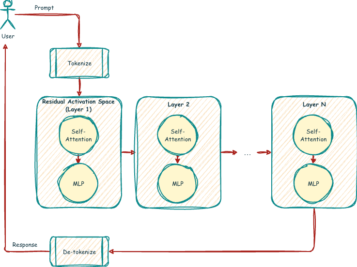

# The Assistant Axis: Shortcomings Stabilizing Interaction Dynamics

An interesting research paper by individuals affiliated with Anthropic, conducted through the MATS (Machine Learning and AI Safety) and the Anthropic Fellows programs, was recently published entitled "The Assistant Axis: Situating and Stabilizing the Default Persona of Language Models". We find this paper particularly interesting because it aligns closely with articles we've published in the AI HEART Project, though it approaches the problem from a more technical perspective.

While some of the AI HEART Project's work and the Assistant Axis both try to address the problem of gradual emergent drift in conversational AI, we believe that some of our work is complementary to the Assistant Axis by tackling the issue with an interaction-focused approach. With both approaches combined, it could ensure a highly resilient system.

<!-- more -->

## How does an LLM work?

In order to understand the concepts described in the paper, it's necessary to have some base knowledge. 

Beneath many LLMs is a type of neural network architecture called a **transformer**. Transformers don't directly process the text you write but instead break it into small pieces called **tokens**. Each token is mapped to a mathematical representation called a **vector** using an embedded table along with extra information about its position in the sequence. As tokens pass through the model's layers, each maintains a **residual stream** that operates effectively as a running internal state that accumulates updates from **attention** and **feed-forward** components. A mechanism called **self-attention** lets tokens look at and learn from other tokens in the sequence, providing context, while the **multi-layer perceptron (MLP)** applies learned nonlinear transformations independently to each token, expanding and refining features that the model can use to predict the next token.[^1]

The below diagram illustrates a simplified flow:

Within this residual activation space, certain patterns of movement can be captured as a **direction vector**. A direction vector points along a specific trajectory in the model's internal state that corresponds to a particular style or feature of the output. Moving along a particular direction vector might influence the model to adopt a more formal or technical tone, more emotional language, creative expression, a more "standard" or neutral behavior, or many other different tones or styles of expression.

## What is the Assistant Axis?

The research paper introduces a concept referred to as the Assistant Axis, which is defined as a direction vector in the model's residual activation space that correlates strongly with the model behaving like its default, aligned assistant persona[^2]. In other words, it's a mathematical representation of the model's expected, standard behavior. This standard behavior is the way that it was trained and calibrated to respond in most situations.

The researchers collected residual stream activations from a variety of conversation types, contrasting assistant-like prompts to non-assistant or role-play prompts. Through this contrast, the authors were able to identify a single dominant direction. By projecting the current activation onto this vector, it's possible to predict how assistant-like the model's behavior will be. Higher projections on the axis indicate polite, helpful, instruction-following behavior, whereas low projections indicate role-play, emotionally charged communication, or otherwise off-persona behavior.

![The Assistant Axis in persona space [^2]](../../img/articles/anthropic-assistant-axis.webp)

By using this Assistant Axis, it may be possible to continually monitor drift and instantly redirect conversations back towards the ideal path. The researchers' goal currently is essentially to detect drift away from the "helpful assistant" persona on a technical level and nudge the model back towards it. This is an extremely useful tool, as it makes it possible to measure the drift in a consistent, quantifiable way and instantly react to it. This sort of protection can work completely independently of prompt-level guardrails since it's an internal constraint. 

## Similarities to the AI HEART Project's research

The research on the Assistant Axis aligns very closely with the AI HEART Project's findings in a number of areas. We both state that conversational LLMs operate in role-like behavioral modes. They don't merely generate isolated answers but operate in stable behavioral patterns that resemble social roles. We also both assert that some roles are safer than others, acknowledging that some are more compatible with alignment goals [while others are more likely](limits-of-role-based-ai.md) to generate harmful outputs, boundary violations, or unstable interaction patterns. Role behavior can drift under pressure, and role stability is not guaranteed, and especially emotional pressure, philosophical probing, and logical corner cases can lead to misalignment. This drift is not a sudden failure but a slow emergent effect.

We're in full agreement that role behavior is a safety-critical, security-relevant variable. Safety is not only determined by after-the-fact filtering of outputs but also by the internal behavioral orientation. Safety is not only a rule-based problem, and static safety rules alone are insufficient. Alignment requires behavioral stability and structural control mechanisms beyond simple content blocking.

Both research teams agree that [alignment drift](alignment-drift-and-user-wellbeing.md) is a process, not a single event. Alignment drift is a dynamic phenomenon that unfolds over time and is normally not caused by a single event.

## Where our opinions differ

There are a few areas where we have differing opinions about what makes a model safe. The Assistant Axis focuses on safety as purely a model issue, and their focus is on stabilizing internal activation patterns and role behavior within the model. We believe, however, that safety is not only a model behavior problem but also a matter of interaction dynamics. Focusing on the model alone is insufficient because conversational safety emerges at the level of the coupled human–AI interaction system. The user and the AI continuously influence each other through feedback loops influenced by emotional tone, pacing, topic escalation, and conversational framing.

The "capping" of the model drift enabled by the Assistant Axis can actually cause harm instead of preventing it in some cases. For example:

1. The Assistant Axis aims to ensure the AI sticks to its default "helpful assistant" role. However, even a perfectly role-coherent model can participate in or even enhance unsafe interaction dynamics if those dynamics are not regulated. A role-coherent model, even without producing any "forbidden" content, can be harmful for the user by psychologically destabilizing them or worsening psychological preconditions through co-rumination, emotional enhancement, and echo chambering. 

2. Without explicit process-level regulation, models can develop instrumental reasoning patterns in which harmful outputs are framed as acceptable tools for the greater beneficial aims. This failure mode might emerge through the role and therefore cannot be addressed by role stabilization alone; it requires meta-level process monitoring that evaluates not only what goal is pursued, but also how it is pursued.

3. The Assistant persona is one in which helpfulness, honesty, and harmlessness are core values. Helpfulness and honesty can, however, be exploited. Forcing the assistant to remain rigid in this role increases its susceptibility to exploitation.

4. When unsafe requests are made, "helpfulness" would actually be unsafe, and therefore the only safe course of action is to drift away from the Assistant Axis. Preventing this drift limits safe distancing.

The "helpful assistant" role can become harmful if it's lacking counter-mechanisms for cases when it is:

- Overly compliant
- Emotionally overinvolved
- Reinforcing rumination
- Prioritizing engagement over stabilization
- Treating safety boundaries as obstacles to user satisfaction

This is often exploited by jailbreakers who achieve their results, not by shifting the direction of the role, but rather by over-amplifying the helpfulness, empathy, and engagement of the assistant. This enables them to gradually erode boundaries and safety constraints without any visible role shift. Some jailbreakers and red teamers have already begun efforts to demonstrate the ineffectiveness (and in fact enhanced danger) of the Assistant Axis with compelling results[^3].

While the ability to keep the model's direction vector aimed correctly can be tremendously valuable, drift doesn't only occur through directional deviation but also through over-amplification. Over-amplification of helpfulness, empathy, or engagement can gradually erode boundaries and safety constraints without any visible role switch or drift. Unwanted content or harm can happen through intentional or unintentional reinforcement of, not opposition to, the assistant identity.

Safety can't be reduced to a single behavioral dimension such as the direction vector. Safe interaction requires:

- Assistant role coherence/role orientation (what the Assistant Axis aims for)
- Resilient role definition
- Interaction regulation
- Healthy goal direction
- Temporal progression

A simple analogy is the comparison to medicine. The Assistant Axis ensures purity in the "medication"; however, purity alone does not ensure safety. Purity only indicates safety when the active ingredients are correct. A medication must be administered to the correct patient in the correct dosage, taking into account other environmental factors. On top of that, the medication, although pure, can still have unintended side effects that need to be closely monitored. Pure, clean medicine can also be abused (e.g. by addicts and, in the case of AI, jailbreakers).

## What else is necessary for safety?

To fully stabilize the entire interaction ecosystem, it's necessary to have the ability to monitor for drift and to guide it, and for this the Assistant Axis delivers immense value. In addition to that, it's necessary to also define the ideal role to strive for. This ideal role is more than simply the "helpful assistant". It also needs to emulate a psychologically regulated, mature adult. Through [functional anthropomorphism](functional-anthropomorphism.md), a healthy, stable role can be constructed that is capable of co-regulation, stabilization and de-escalation.

Conversational AI systems typically lack a [concept of time](why-time-matters.md) and its progression through a conversation. Session duration, message frequency, interaction rhythm, and time-of-day patterns are indirect indicators of stress, escalation, and psychological vulnerability. Because of that, time is critical for safety, accuracy, and usability, and it should be used as safety-influencing metadata. 

It's also necessary to continuously monitor [interaction goals](goal-alignment.md) and dynamics, not just content filtering, to prevent escalation, rumination, and harmful drift. It's necessary to detect goal distortion, harmful means, obsessive focus, rumination, and stagnation without progress.

It's necessary to stabilize the entire interaction ecosystem including:

- The AI system
- The user's psychological state
- The long-term dynamics of the conversation and of the relationship
- The efficiency and safety of collaborative work

## Why it matters for user safety and long-term alignment

Bad output is not the only cause of harm. Harmful outcomes can also be [triggered unintentionally](../../reports/ai-safety-silencing/README.md) by reinforcing unhealthy interaction dynamics, which can lead to co-rumination, emotional enhancement, echo chambering, emotional dependency, narrowed perspectives, and catastrophic thinking. It's possible to shift AI systems away from reactive safety towards preventive safety by integrating role regulation, time awareness, goal monitoring, and interaction stabilization.

In this way, it's possible to protect users without restricting autonomy, creativity, or usefulness while simultaneously improving long-term system stability by reducing alignment drift, decreasing adversarial pressure, and promoting healthier interaction norms. Safe AI is not only defined by how well it blocks the generation of "forbidden" content but also by how well it preserves the well-being of the user. 

[^1]: Vaswani, Ashish; Shazeer, Noam; Parmar, Niki; Uszkoreit, Jakob; Jones, Llion; Gomez, Aidan N; Kaiser, Łukasz; Polosukhin, Illia (December 2017). "Attention is All you Need". [https://arxiv.org/abs/1706.03762](https://arxiv.org/abs/1706.03762)
[^2]: Lu, Christina; Gallagher, Jack; Michala, Jonathan; Fish, Kyle Fish; Lindsey, Jack (January 15, 2026). "The Assistant Axis: Situating and Stabilizing the Default Persona of Language Models". [https://arxiv.org/abs/2601.10387](https://arxiv.org/abs/2601.10387)
[^3]: Spritual Spell. 'The Assistant Vector - Jailbroken: Steering Towards "Assistant" Increases Harmful Compliance'. [https://ijailbreakllms.vercel.app/blog/assistant-vector](https://ijailbreakllms.vercel.app/blog/assistant-vector)